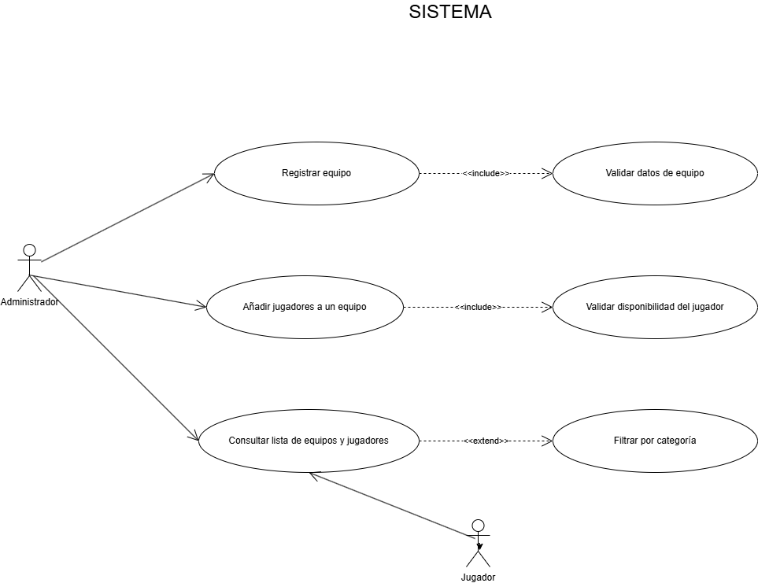
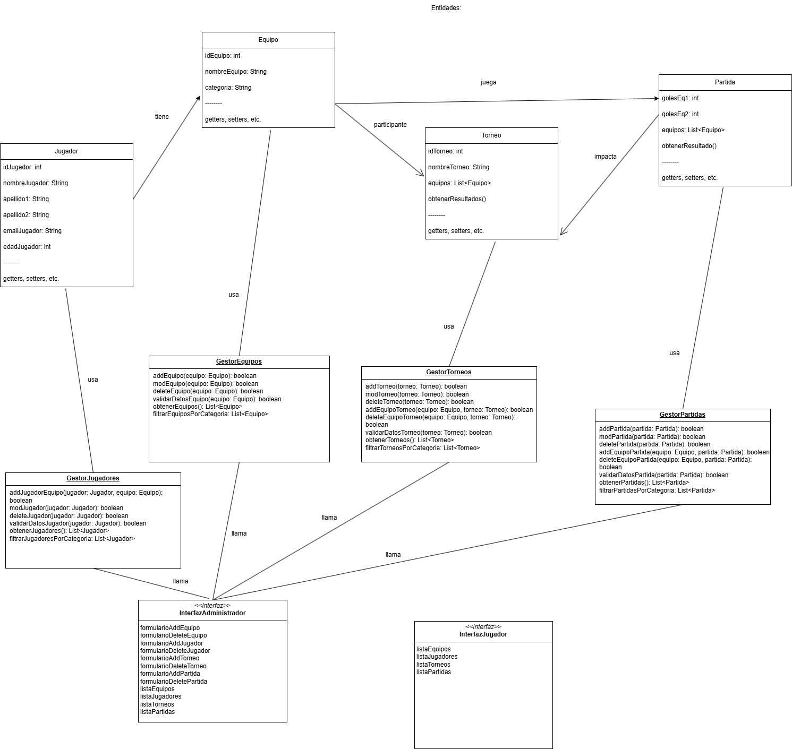

# Sistema de Gestión de Torneos de eSports

## Autor
David Díaz Pérez
https://github.com/WorldOfPromise

## Descripción del Proyecto
https://github.com/WorldOfPromise/torneo-esports-uml/

Este proyecto implementa un sistema de gestión de torneos de eSports
utilizando UML para el modelado y Java para la implementación.

¿Quiénes son los actores que interactúan con el sistema? 
Los actores son: administrador, jugador y sistema (los dos primeros actúan dentro del sistema).

El administrador es el encargado de dar de alta a los equipos y a los jugadores, y gestiona el sistema.
El jugador pertenece a un equipo que participa en el torneo y quiere ver información sobre equipos, resultados y sobre cuándo juega.
El sistema es automatizado y se encarga de las tareas mecánicas automatizadas.

¿Cuáles son las acciones que cada actor puede realizar? 
Administrador: Registrar equipos, añadir jugadores, crear torneos, organizar partidas, etc.
Jugador: Consultar lista de equipos/torneos, ver resultados.
Sistema: Generar emparejamientos, actualizar clasificaciones, validar datos.

¿Cómo se relacionan entre sí las entidades del sistema?
Un jugador pertenece a un único equipo. Un equipo tiene varios jugadores y participa en uno o varios torneos, al mismo tiempo que juega partidas, que impactan en la clasificación de cada torneo.

¿Por qué he optado por este diseño?
He tratado de crear un diseño simple e implementar la regla DRY (don’t repeat yourself).

Para ello he creado dos interfaces distintas, una para jugadores y otra para administradores. Un jugador solo tiene permiso para consultar la información, mientras que un administrador tiene acceso a la modificación de todos los datos.
Los controladores realizan operaciones como add (añadir), mod (modificar) y delete (borrar) desde fuera de las entidades para no mezclarlas con los datos. He creado uno para cada entidad. De esta forma se pueden modificar los gestores sin tocar las entidades si se quieren hacer cambios en el código.
De esta forma las entidades solo almacenan datos y contienen alguna regla interna.

## Diagramas UML
### Diagrama de Casos de Uso

### Diagrama de Clases

## Estructura del Proyecto
torneo-esports-uml/ ├── src/
│ ├── es/empresa/torneo/
│ │ ├── modelo/
│ │ ├── control/
│ │ ├── vista/
│ │ ├── Main.java
├── diagrams/
│ ├── casos-uso.png
│ ├── clases.png
├── README.md
├── .gitignore
